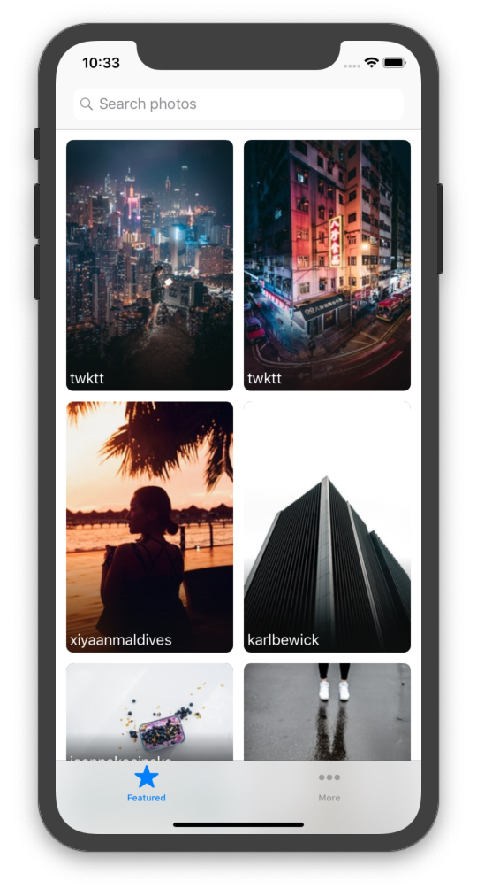

# Discover-Photo
An iOS photo discovery app using [Unsplash API](https://unsplash.com/developers)

## Requirements

- iOS 10.0 or later
- Xcode 10.2

## Build

Install [carthage](https://github.com/Carthage/Carthage#installing-carthage)

Run this command:

```sh
carthage build --platform iOS
```

## Problems

Assume that a user wants to find some specific photos.

The user might want to search a keyword such as “food”, “lake”, “car”, etc.

The user could tap on a photo. And might want to see more related photos of that photo.

## Solves

Put a search bar on top of the first view controller. Users can search for keywords as soon as they want. The idea came from Pinterest.

Below the search bar, there's a waterfall layout collection view. Users can explore photos easily. And rounded corners make users comfortable.

Every cell has a gradient blur to make the uploader's name clearly.

When the user scrolls down. Collection view will load more contents.

Users can tap a photo and view it in a larger size.

## Things I'm considering to do in the future

Add shadow to cells to make it feel 3D.

Show detail information and related photos after a tap on a cell. I think related photos are important. Because it is easy to find the user's preference.

Add database and bookmark features.

Get the user's preference from bookmarks.

## Screenshots




